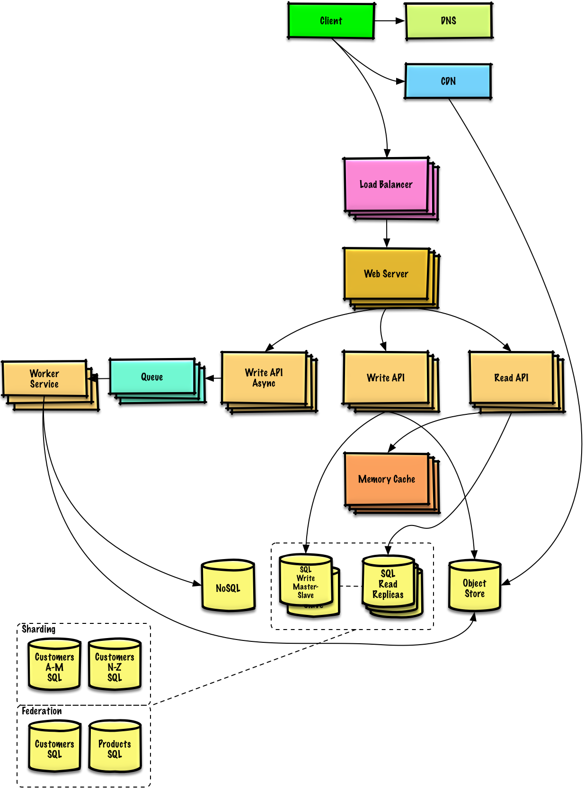

# System Design Interview

# 一、如何处理一个系统设计面试题？

## 第一步：描述使用场景，约束和假设

通过不停的提问与沟通，明确系统的使用场景和约束，作出相关假设：

- a. 明确用户
  - 用户群体
  - 如何使用该系统
  - 用户量
- b. 明确系统功能
  - 系统的功能
  - 系统输入输出是什么
- c. 系统处理能力
  - 系统处理的数据量
  - 请求处理能力
  - 读写比率

## 第二步：构建一个初步的高层级的设计

使用所有重要的组件来描绘出一个高层级的设计

- 画出主要的组件和连接
- 模拟用户请求处理流程

## 第三步：设计核心组件

- 面向对象设计 
  - 数据结构设计
  - DB schema设计，估算占用的磁盘空间
- API设计
  - 前后端接口，交互逻辑

## 第四步：扩展设计

确认和处理瓶颈以及一些限制

- 负载均衡
- 水平扩展
- 缓存
- 数据库分片

# 二、基础知识储备

# 三、系统设计的面试题和解答

| 问题             |          |
| ---------------- | -------- |
| 火车抢票系统设计 | [解答]() |

