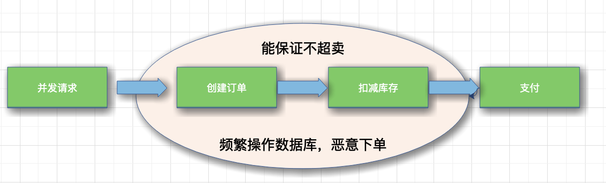
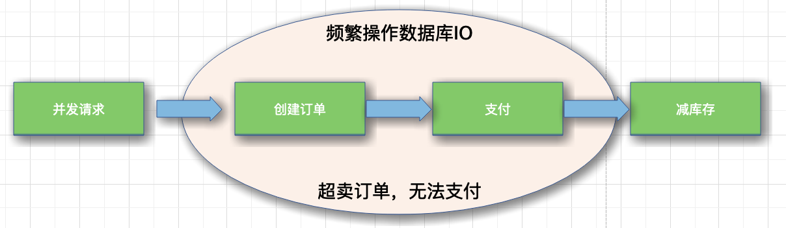
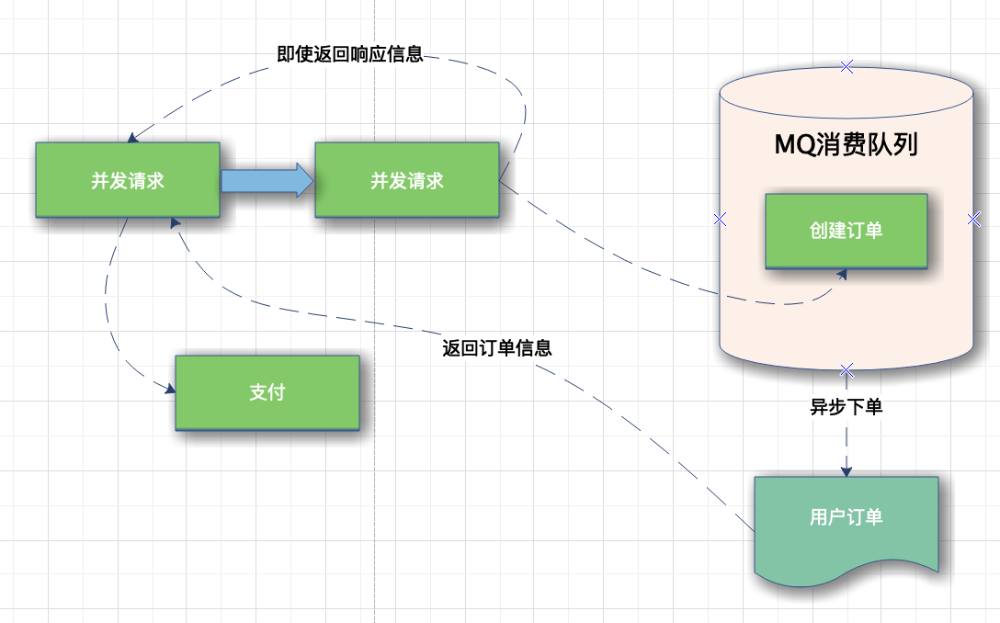
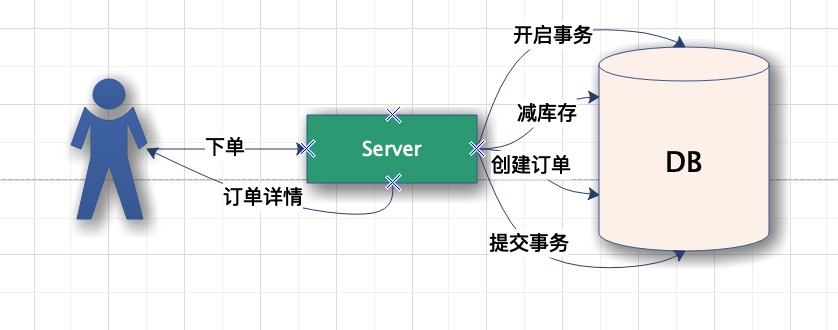
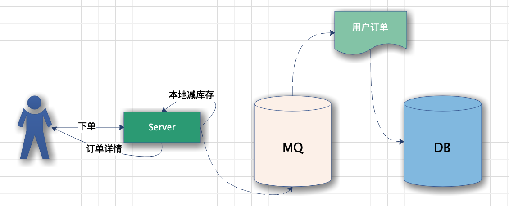
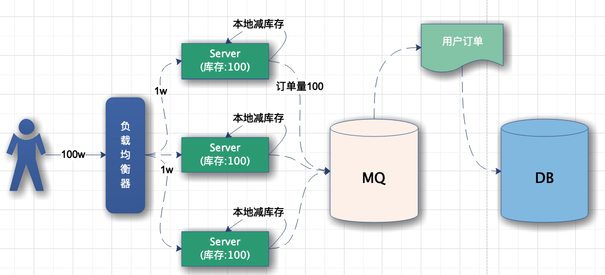
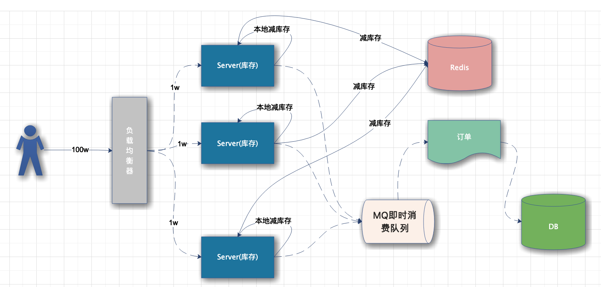

# 火车票售卖系统

设计类似12306的售票系统，主要涉及如下核心功能：

- 余票查询
- 抢票
- 退票

# 一、概述用例和约束

如果没有面试官来回答澄清问题，我们将定义一些用例和约束。

## 用例

- 用户输入出发城市、目的城市、发车时间
  - 返回：所有匹配的车次信息、剩余票数
- 用户选中车次，下订单并完成支付
  - 下订单后，车次被锁定，但未成功扣减库存
  - 订单在支付前一段时间可以过期
  - 订单支付后，完成对库存锁定
- 根据票证信息，返还其库存
- 服务能够承受高并发
- 服务高可用性

## 约束和假设

状态假设

- 下订单应该很快
- 1亿活跃用户
- 每天1000,000订单量
- 高峰期1500亿浏览量/天

估算计算量

- 每笔交易的规模
  - user_id(用户id) - 8 bytes
  - created_at(创建时间) - 5 bytes
  - start_pos(出发地) -  32bytes
  - end_pos(目的地) - 32bytes
  - departure_at(发车时间) - 5 bytes
  - amount(金额) - 16 bytes
  - pay_at(支付时间) - 5 bytes
  - Total(总计) - 120 bytes
- 每秒500张票
- 每天约200GB的订单量

# 二、高层级设计

通常订票系统要处理生成订单、减扣库存、用户支付这三个基本的阶段。

## 下单减库存

当用户并发请求到达服务端时，首先创建订单，然后扣除库存，等待用户支付，创建订单和扣减库存通过事务封装为原子操作。

但是这样也会产生一些问题：

- 在极限并发情况下，任何一个内存操作的细节都至关影响性能，尤其像创建订单这种逻辑，一般都需要存储到磁盘数据库的，对数据库的压力是可想而知的。
- 如果用户存在恶意下单的情况，只下单不支付这样库存就会变少，会少卖很多订单，虽然服务端可以限制 IP 和用户的购买订单数量，这也不算是一个好方法。

## 支付减库存

- 如果等待用户支付了订单在减库存，第一感觉就是不会少卖。但是这是并发架构的大忌，因为在极限并发情况下，用户可能会创建很多订单。
- 当库存减为零的时候很多用户发现抢到的订单支付不了了，这也就是所谓的【超卖】。也不能避免并发操作数据库磁盘 IO。

## 预扣库存

从上边两种方案的考虑，我们可以得出结论：只要创建订单，就要频繁操作数据库 IO。

那么有没有一种不需要直接操作数据库 IO 的方案呢，这就是**预扣库存**。

- 先扣除了库存，保证不超卖，然后异步生成用户订单，这样响应给用户的速度就会快很多；那么怎么保证不少卖呢？用户拿到了订单，不支付怎么办？

- 现在订单都有有效期，比如说用户五分钟内不支付，订单就失效了，订单一旦失效，就会加入新的库存，这也是现在很多网上零售企业保证商品不少卖采用的方案。

- 订单的生成是异步的，一般都会放到 MQ、Kafka 这样的即时消费队列中处理，订单量比较少的情况下，生成订单非常快，用户几乎不用排队。

## 扣库存的艺术

在单机低并发情况下，我们实现扣库存通常是这样的：

为了保证扣库存和生成订单的原子性，需要采用事务处理，然后取库存判断、减库存，最后提交事务，整个流程有很多 IO，对数据库的操作又是阻塞的。

这种方式根本不适合高并发的秒杀系统。接下来我们对单机扣库存的方案做优化：**本地扣库存**。

### 本地扣库存

把一定的库存量分配到本地机器，直接在内存中减库存，然后按照之前的逻辑异步创建订单，改进后的单机系统如下：

这样就避免了对数据库频繁的 IO 操作，只在内存中做运算，极大的提高了单机抗并发的能力。

但是百万的用户请求量单机是无论如何也抗不住的，因此需要增加服务器数量，并做好负载均衡(Nginx)。

例如：假设将 100W 的用户请求量平均均衡到 100 台服务器上，减小单机负载；每台机器本地库存100张火车票，100台服务器上总共还是1w张，这样保证了库存订单不超卖，下面是我们描述的集群架构：

在高并发情况下，现在还是无法保证系统的高可用性，例如100台机器，其中某几台宕机，那么这些服务器上的票就无法卖出，造成订单少卖。

因此，要解决该问题，需要对总订单量做统一管理，这就是接下来的容错方案：

- 服务器不仅要在本地减库存，另外要远程统一减库存
- 有了远程统一减库存的操作，我们就可以根据机器负载情况，为每台机器分配一些多余的“Buffer 库存”用来防止机器中有机器宕机的情况

架构设计图如下：

采用Redis存储订单库存，因为 Redis 的性能非常高，号称单机 QPS 能抗 10W 的并发，并且redis支持Master-slave和能够保证服务的高可用性。

- 在本地减库存以后，如果本地有订单，我们再去请求 Redis 远程减库存，本地减库存和远程减库存都成功了，才返回给用户抢票成功的提示，这样也能有效的保证订单不会超卖。
- 当机器中有机器宕机时，因为每个机器上有预留的 Buffer 余票，所以宕机机器上的余票依然能够在其他机器上得到弥补，保证了不少卖。
- Buffer 余票设置多少合适呢，理论上 Buffer 设置的越多，系统容忍宕机的机器数量就越多，但是 Buffer 设置的太大也会对 Redis 造成一定的影响。
- 虽然 Redis 内存数据库抗并发能力非常高，请求依然会走一次网络 IO，其实抢票过程中对 Redis 的请求次数是本地库存和 Buffer 库存的总量。
- 本地库存不足时，系统直接返回用户“已售罄”的信息提示，就不会再走统一扣库存的逻辑。

# 三、设计核心组件

# 四、扩展设计

